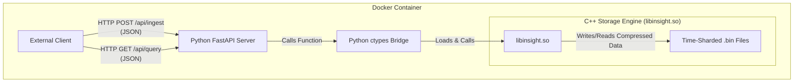

# C++ Time-Series Database (Insight-TSDB)

A high-performance time-series database engine built from scratch in C++ and exposed via a Python/FastAPI service. This project is a deep dive into the fundamentals of data engineering, focusing on performance, storage efficiency, and professional software practices.  
The system is designed to ingest numerical time-series data, store it efficiently using custom compression, and query it with low latency.

## Key Features & Architectural Highlights

- **Custom C++ Storage Engine:** Core logic is written in modern C++ (C++17) for maximum performance and control over memory.
- **High-Performance Querying:** A time-sharded storage architecture minimizes I/O, enabling sub-millisecond latencies for hot-cache reads.
- **Efficient Compression:** Implemented bespoke, time-series-specific compression algorithms (Delta-of-Delta and XOR) to drastically reduce storage footprint.
- **Modern API Layer:** A clean, documented API is provided using Python 3 and FastAPI for easy integration.
- **Professional Tooling:** Fully containerized with Docker, built with CMake, and unit-tested via Pytest and a C++ suite.

## Performance Benchmarks

Benchmarks were run on a local WSL2 environment by ingesting and querying a dataset of 1,000,000 pseudo-realistic data points. The results demonstrate a clear trade-off, prioritizing extremely fast read latencies.

| Metric                   | Result           | Analysis                                                                                                        |
|--------------------------|------------------|-----------------------------------------------------------------------------------------------------------------|
| Storage Efficiency       | ~8.2 bytes/point | 50% reduction in storage compared to uncompressed 16-byte data points, via custom compression on high-entropy data. |
| Hot Query Latency (p99)  | ~1.3 ms          | Querying a 1-hour window of recent data (3,600 points); quick due to page caching and efficient decompression.   |
| Cold Query Latency (p99) | ~16 ms           | Querying a 24-hour window of older data (86,400 points); time-sharding avoids full scan of entire dataset.       |
| Ingestion Throughput     | ~5,500 points/sec| Baseline performance; bottleneck is per-point file I/O—batch ingestion API proposed for optimization.            |

## System Architecture



## How to Build and Run

This project is fully containerized and can be built and run with two commands.

### Prerequisites

- [Docker](https://www.docker.com/products/docker-desktop/)
- Git

### 1. Build the Docker Image

Clone the repository and run the Docker build command from the project root.

```bash
git clone https://github.com/KaranSinghDev/cpp-time-series-database.git
cd cpp-time-series-database
docker build -t insight-service .
```

### 2. Run the Container

```bash
docker run -p 8000:8000 insight-service
```

The service is now running and accessible at `http://127.0.0.1:8000`. Interactive API documentation is available at `http://127.0.0.1:8000/docs`.

## Local Development & Testing

For developers who wish to build and test the components manually.

### Prerequisites

- A C++17 compiler (`g++`) & CMake
- Python 3.10+ & pip

### 1. Build the C++ Engine

```bash
cd engine
cmake -B build
cmake --build build
```

### 2. Run the C++ Unit Tests

```bash
./engine/build/engine_test
```

### 3. Set Up the Python Environment

```bash
# From the project root
python3 -m venv venv
source venv/bin/activate
pip install -r requirements.txt
```

### 4. Run the Python Integration Tests

```bash
LD_LIBRARY_PATH=./engine/build pytest
```
